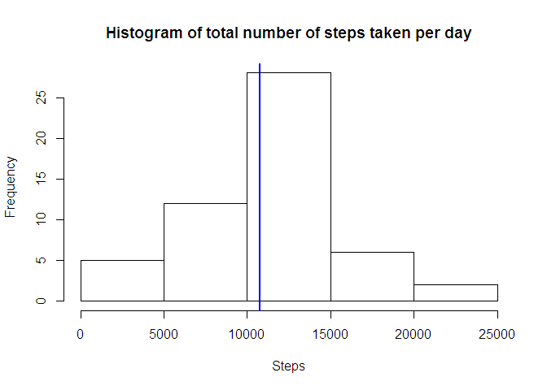
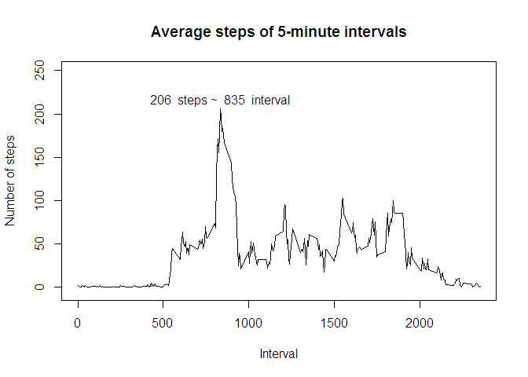

# Personal movement analysis using activity monitoring devices
Shansh  
Friday, January 08, 2016  

This document represents response on the issues raised in assignment from Coursera Reproducible Research Course Project 1. The document was created as R Markdown file and subsequently processed with 'knit2html()' function.


```r
library(knitr)
opts_knit$set(root.dir = "C:/Documents and Settings/Administrator/My Documents/R/")
```

## Loading and preprocessing the data

```r
temp <- tempfile()
download.file("http://d396qusza40orc.cloudfront.net/repdata%2Fdata%2Factivity.zip",temp, mode="wb")
con <- unz(temp, "activity.csv")
data <- read.table(con, header = TRUE, sep=",")
unlink(temp)
print(paste0("There are ", sum(is.na(data)), " NA's in dataset"))
```

```
## [1] "There are 2304 NA's in dataset"
```

```r
data_cc <- data[complete.cases(data), ]
print(paste0("There are ", dim(data_cc)[1], " complete cases in dataset"))
```

```
## [1] "There are 15264 complete cases in dataset"
```

## What is mean total number of steps taken per day?

```r
library(dplyr)
```

```
## 
## Attaching package: 'dplyr'
## 
## The following objects are masked from 'package:stats':
## 
##     filter, lag
## 
## The following objects are masked from 'package:base':
## 
##     intersect, setdiff, setequal, union
```

```r
sum_spd <- summarise(group_by(data_cc, date),
                 sum=sum(steps))

mean_spd <- mean(sum_spd$sum)
median_spd <- median(sum_spd$sum)

hist(sum_spd$sum, breaks = 5, xlab="Steps", 
     main = "Histogram of total number of steps taken per day")
abline(v = mean_spd, col = "blue", lwd = 2)
```

 

```r
print(paste0("Mean of total number of steps taken per day is ", round(mean_spd, 2)))
```

```
## [1] "Mean of total number of steps taken per day is 10766.19"
```

```r
print(paste0("Median of total number of steps taken per day is ", median_spd))
```

```
## [1] "Median of total number of steps taken per day is 10765"
```

## What is the average daily activity pattern?

```r
mean_int <- summarise(group_by(data_cc, interval),
                      mean = mean(steps))

y <- max(mean_int$mean)
x <- as.numeric(mean_int[mean_int$mean == y, 1])
plot(mean_int$mean ~ mean_int$interval, type = "l",
     ylim = c(-5, 250), ylab = "Number of steps", xlab = "Interval",
     main = "Average steps of 5-minute intervals") 
text(x, y + 10, labels = paste(round(y, 0), " steps ~ ", x, " interval"))
```

 

```r
print(paste0("The 5-minute interval that, on average, contains the maximum number of steps is ", x))
```

```
## [1] "The 5-minute interval that, on average, contains the maximum number of steps is 835"
```

## Imputing missing values

Count of missing values in the data set is

```r
sum(is.na(data))
```

```
## [1] 2304
```
Count of missing values in the steps column is

```r
sum(is.na(data$steps))
```

```
## [1] 2304
```
Therefore, all NA's are placed in steps column.

The strategy for imputing missing values was to replace NA's with the mean for that 5-minute interval. 

```r
for (i in 1:dim(data)[1]) {
        if (is.na(data$steps[i])) {
                int <- data[i, 3]
                avg_row <- mean_int[mean_int$interval == int, ]
                avg_step <- as.numeric(avg_row[2])
                data$steps[i] <- avg_step
        }   
}

sum_spd_na <- summarise(group_by(data, date),
                     sum = sum(steps), mean = mean(steps))

mean_spd_na <- mean(sum_spd_na$sum)
median_spd_na <- median(sum_spd_na$sum) 

hist(sum_spd_na$sum, breaks = 5, xlab="Steps", 
     main = "Histogram of total number of steps taken per day")
abline(v = mean_spd_na, col = "blue", lwd = 2)
```

 

```r
print(paste0("Mean of total number of steps taken per day is (missing data imputed) ", round(mean_spd_na, 2)))
```

```
## [1] "Mean of total number of steps taken per day is (missing data imputed) 10766.19"
```

```r
print(paste0("Median of total number of steps taken per day is (missing data imputed) ", round(median_spd_na, 2)))
```

```
## [1] "Median of total number of steps taken per day is (missing data imputed) 10766.19"
```
Mean and median values of the new data set, with missing data imputed, look very much the same as those from data set where missing values has been removed. In the new histogram frequency of middle break has increased, due to strategy of imputation of missing values (mean for that 5-minute interval).

## Are there differences in activity patterns between weekdays and weekends?

```r
library(lattice) 

data$date <- as.Date(data$date)

data <- mutate(data, weekday = weekdays(date)) %>%
        mutate(workday = ifelse(weekday == "Saturday" | weekday == "Sunday", "Weekend", "Weekday"))

data$workday <- as.factor(data$workday)

xyplot(data$steps ~ data$interval | data$workday,
       xlab = "Interval",
       ylab = "Number of steps",
       layout=c(1,2), type = "l")
```

 

```r
print("On weekdays people start making personal movements earlier than on weekend and frequencies of steps are more intensive.")
```

```
## [1] "On weekdays people start making personal movements earlier than on weekend and frequencies of steps are more intensive."
```
